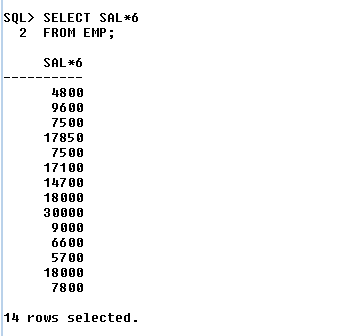
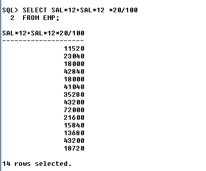
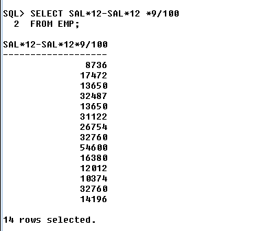
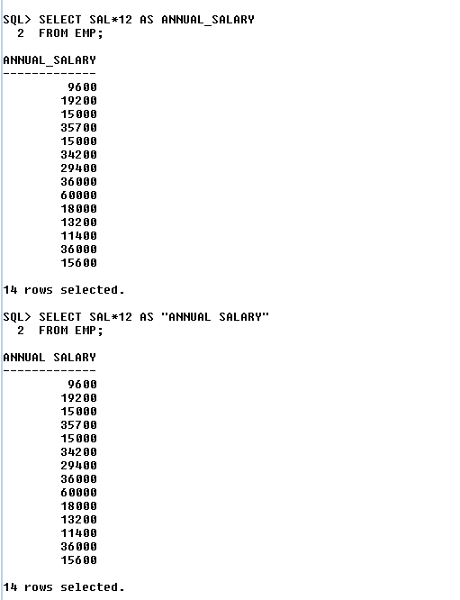
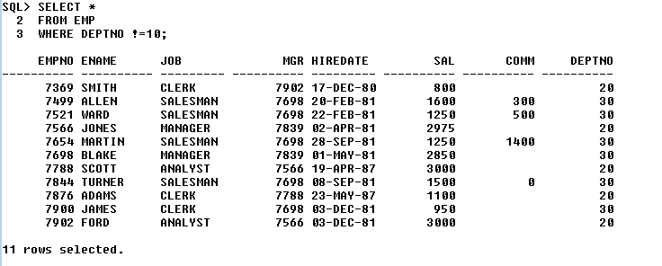
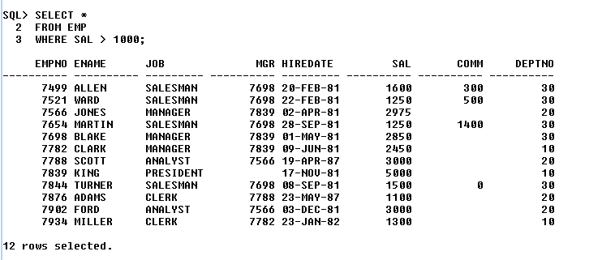
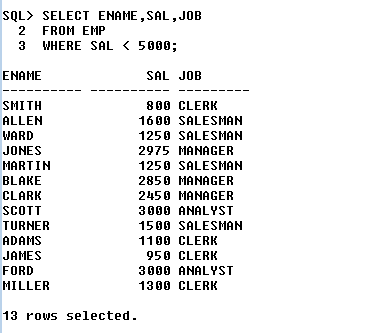
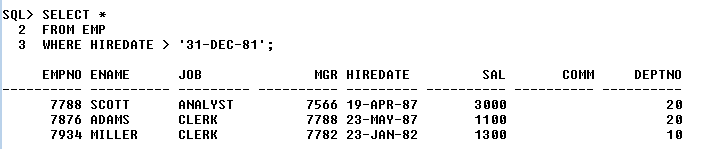

# The SQL*Plus

## 1) how to create a table with out constrain 


```bash
create table EMPLOYEE
(
Sno number(5),
Name varchar(20),
Phone number(10),
branch varchar(5)
);
```
## 2) how to create a table with constrain 


```bash
create table table_name
(
Sno number(5) check(Sno>0) primary key,
Name varchar(20) not null,
Phone number(10) not null unique check(length(Phone)=10),
branch varchar(5) not null
);

```

## 3) how to rename table name 


```bash
RENAME Old_name to new_name;
```
## 4) how to delete table permanently from data base 

```bash
truncate table EMPLOYEE2;
```
### Truncate will empty the table (will not remove the table structure)

## 5) how to drop the table from database


```bash
drop table table_name;
```

## 6) 


# create table Like this 


## THIS QUREY FOR CREATING EMP TABLE

```bash
CREATE TABLE EMP (
    EMPNO NUMBER(4),
    ENAME VARCHAR2(10),
    JOB VARCHAR2(9),
    MGR NUMBER(4),
    HIREDATE DATE,
    SAL NUMBER(7,2),
    COMM NUMBER(7,2),
    DEPTNO NUMBER(2)
);
```

## INSERTING DATA INTO EMP TABLE 

```bash
INSERT INTO EMP VALUES (7369, 'SMITH', 'CLERK', 7902, TO_DATE('17-DEC-80', 'DD-MON-YY'), 800, NULL, 20);
INSERT INTO EMP VALUES (7499, 'ALLEN', 'SALESMAN', 7698, TO_DATE('20-FEB-81', 'DD-MON-YY'), 1600, 300, 30);
INSERT INTO EMP VALUES (7521, 'WARD', 'SALESMAN', 7698, TO_DATE('22-FEB-81', 'DD-MON-YY'), 1250, 500, 30);
INSERT INTO EMP VALUES (7566, 'JONES', 'MANAGER', 7839, TO_DATE('02-APR-81', 'DD-MON-YY'), 2975, NULL, 20);
INSERT INTO EMP VALUES (7654, 'MARTIN', 'SALESMAN', 7698, TO_DATE('28-SEP-81', 'DD-MON-YY'), 1250, 1400, 30);
INSERT INTO EMP VALUES (7698, 'BLAKE', 'MANAGER', 7839, TO_DATE('01-MAY-81', 'DD-MON-YY'), 2850, NULL, 30);
INSERT INTO EMP VALUES (7782, 'CLARK', 'MANAGER', 7839, TO_DATE('09-JUN-81', 'DD-MON-YY'), 2450, NULL, 10);
INSERT INTO EMP VALUES (7788, 'SCOTT', 'ANALYST', 7566, TO_DATE('19-APR-87', 'DD-MON-YY'), 3000, NULL, 20);
INSERT INTO EMP VALUES (7839, 'KING', 'PRESIDENT', NULL, TO_DATE('17-NOV-81', 'DD-MON-YY'), 5000, NULL, 10);
INSERT INTO EMP VALUES (7844, 'TURNER', 'SALESMAN', 7698, TO_DATE('08-SEP-81', 'DD-MON-YY'), 1500, 0, 30);
INSERT INTO EMP VALUES (7876, 'ADAMS', 'CLERK', 7788, TO_DATE('23-MAY-87', 'DD-MON-YY'), 1100, NULL, 20);
INSERT INTO EMP VALUES (7900, 'JAMES', 'CLERK', 7698, TO_DATE('03-DEC-81', 'DD-MON-YY'), 950, NULL, 30);
INSERT INTO EMP VALUES (7902, 'FORD', 'ANALYST', 7566, TO_DATE('03-DEC-81', 'DD-MON-YY'), 3000, NULL, 20);
INSERT INTO EMP VALUES (7934, 'MILLER', 'CLERK', 7782, TO_DATE('23-JAN-82', 'DD-MON-YY'), 1300, NULL, 10);
```

## THIS QUREY FOR CREATING DEPT TABLE

```bash
CREATE TABLE DEPT (
    DEPTNO NUMBER(2),
    DNAME VARCHAR2(14),
    LOC VARCHAR2(13)
);
```
## INSERTING DATA INTO DEPT TABLE 

```bash
INSERT INTO DEPT VALUES (10, 'ACCOUNTING', 'NEW YORK');
INSERT INTO DEPT VALUES (20, 'RESEARCH', 'DALLAS');
INSERT INTO DEPT VALUES (30, 'SALES', 'CHICAGO');
INSERT INTO DEPT VALUES (40, 'OPERATIONS', 'BOSTON');
```
## NOW RUN THIS COMMAND 

```bash
SELECT * FROM EMP;
SELECT * FROM DEPT;
```
## 1) HOW TO DISPLAY NAME FROM EMP TABLE
```bash
SELECT ENAME
FROM EMP;
```


## 2) HOW TO DISPLAY ALL THE COLUMNS FROM EMP TABLE
```bash
SELECT *
FROM EMP;
```


## 3) HOW TO DISPLAY ANNUAL SALARY FOR EMPOYEE
```bash
SELECT SAL*12
FROM EMP;
```


## 4) HOW TO DISPLAY HALF TERM ANNUAL SALARY FOR EMPOYEE
```bash
SELECT SAL*6
FROM EMP;
```


## 5) HOW TO DISPLAY HALF TERM ANNUAL SALARY FOR EMPOYEE
```bash
SELECT SAL*6
FROM EMP;
```


## 6) HOW TO DISPLAY YEAR SALARY WITH 20% HIKE EMPOYEE
```bash
SELECT SAL*12+SAL*12 *20/100
FROM EMP;
```


## 7) HOW TO DISPLAY YEAR SALARY WITH 20% HIKE EMPOYEE
```bash
SELECT SAL*12-SAL*12 *9/100
FROM EMP;
```

<br/>
<br/>

# ALIAS
<h3>
* Alias is an alternative name which is assigned for a column name or an experssion in the result table <br/>
* we can assign alias name with or without using "As" Keywords <br/>
* Alias name must be a Single String Which is Seperate by an Unterscorce or enclosed within double quotes
</h3>

## 1) HOW TO Change output column name 
```bash
SELECT SAL*12 AS ANNUAL_SALARY
FROM EMP;
```
## OR 
```bash
SELECT SAL*12 AS "ANNUAL SALARY"
FROM EMP;
```


# SELECT CLAUS
<h3>
* Select is used to Retive the Data By Selecting Row and Columns
</h3>

## 1) WAQTD names of the employees if they are working in department number 10

```bash
SELECT ENAME
FROM EMP
WHERE DEPTNO= 10;
```


## 2) WAQTD detail of the employees if they are not working in department number 10

```bash
SELECT *
FROM EMP
WHERE DEPTNO !=10;
```


## 3) WAQTD det ails of the employees if they are getting salary more than 1000

```bash
SELECT *
FROM EMP
WHERE SAL > 1000;
```


## 4) WAQTD Name Salary and Designation of the employees if they are getting salary less then 5000

```bash
SELECT ENAME,SAL,JOB
FROM EMP
WHERE SAL < 5000;
```


## 5) WAQTD Details of the Employee if they are working as manager

```bash
SELECT *
FROM EMP
WHERE JOB = 'MANAGER';
```


## 6) WAQTD Details of the employee if they hired after 81

```bash
SELECT *
FROM EMP
WHERE HIREDATE > '31-DEC-81';
```


## 7) WAQTD name and sala along with his Annual salary if the annual salary is more than 1200 

```bash
SELECT ENAME, SAL, SAL*12 AS ANNUAL_SALARY
FROM EMP
WHERE SAL*12 < 1200;
```

## 8) WAQTD EMPNO OF THE EMPLOYEES WHO ARE WORKING IN DEPT 30 

```bash
SELECT EMPNO , DEPTNO
FROM EMP
WHERE DEPTNO = 30;
```

## 9) WAQTD ENAME AND HIREDATE IF THEY ARE HIRED BEFORE 1981
```bash
SELECT ENAME, HIREDATE
FROM EMP
WHERE HIREDATE < TO_DATE('01-JAN-1981', 'DD-MON-YYYY');
```

## 10) WAQTD DETAILS OF THE EMPLOYEES WORKING AS MANAGER
```bash
SELECT *
FROM EMP
WHERE JOB = 'MANAGER';
```

## 11) WAQTD NAME AND SALARY GIVEN TO AN EMPLOYEE IF EMPLOYEE EARNS A COMMISSION OF RUPEES 1400
```bash
SELECT ENAME,SAL,COMM
FROM EMP
WHERE COMM = 1400;
```
## 12) WAQTD DETAILS OF THE EMPLOYEES HAVING COMMISSION MAORE THAN SALARY 
```bash
SELECT *
FROM EMP
WHERE SAL < COMM;
```

# SELECT CLAUS WITH DUAL CONDTION 
<h3>
HI
</h3>

## 1) WAQTD DETAILS OF THE EMPLOYEES WORKING AS CLERK AND EARNING LESS THAN 1500
```bash

```

## 2) WAQTD NAME AND HIREDATE OF THE EMPLOYEES WORKING AS MANAGER IN DEPT 30
```bash

```

## 3) WAQTD DETAILS OF THE EMP ALONG WITH ANNUAL SALARY IF THEY ARE WORKING IN DEPT 30 AS SALESMAN AND THEIR ANNUAL SALARY HAS TO BE GREATER THAN 14000
```bash

```

## 4) WAQTD ALL THE DETAILS OF THE EMP WORKING IN DEPT 30 OR AS ANALYST
```bash

```

## 5) WAQTD NAMES OF THE EMPLOYEES WHOSE SALARY IS LESS THAN 1100 AND THEIR DESIGNATION IS CLERK
```bash

```

## 6) WAQTD NAME AND SAL, ANNUAL SAL AND DEPTNO IF DEPTNO IS 20 EARNING MORE THAN 1100 AND ANNUAL SALARY EXCEEDS 12000
```bash

```

## 7) WAQTD EMPNO AND NAMES OF THE EMPLOYEES WORKING AS MANAGER IN DEPT 20
```bash

```
## 8) WAQTD DETAILS OF EMPLOYEES WORKING IN DEPT 20 OR 30
```bash

```

## 9) WAQTD DETAILS OF EMPLOYEES WORKING AS ANALYST IN DEPT 10
```bash

```

## 10) WAQTD DETAILS OF EMPLOYEE WORKING AS PRESIDENT WITH SALARY OF RUPEES 4000
```bash

```

## 11) WAQTD NAMES AND DEPTNO, JOB OF EMPS WORKING AS CLERK IN DEPT 10 OR 20
```bash

```

## 12) WAQTD DETAILS OF EMPLOYEES WORKING AS CLERK OR MANAGER IN DEPT 10
```bash

```

## 13) WAQTD NAMES OF EMPLOYEES WORKING IN DEPT 10, 20, 30, 40
```bash

```

## 14) WAQTD DETAILS OF EMPLOYEES WITH EMPNO 7902, 7839
```bash

```

## 15)WAQTD DETAILS OF EMPLOYEES WORKING AS MANAGER OR SALESMAN OR CLERK
```bash

```

## 16)WAQTD NAMES OF EMPLOYEES HIRED AFTER 81 AND BEFORE 87
```bash

```

## 17) WAQTD DETAILS OF EMPLOYEES EARNING MORE THAN 1250 BUT LESS THAN 3000
```bash

```

## 18) WAQTD NAMES OF EMPLOYEES HIRED AFTER 81 INTO DEPT 10 OR 30
```bash

```
## 19) WAQTD NAMES OF EMPLOYEES ALONG WITH ANNUAL SALARY FOR THE EMPLOYEES WORKING AS MANAGER OR CLERK INTO DEPT 10 OR 30
```bash

```

## 20) WAQTD ALL THE DETAILS ALONG WITH ANNUAL SALARY IF SAL IS BETWEEN 1000 AND 4000 ANNUAL SALARY MORE THAN 15000


# ASSIGNMENT ON EXPRESSION & ALIAS
<h3>
HI
</h3>

## 1)WAQTD NAME OF THE EMPLOYEE ALONG WITH THEIR ANNUAL SALARY.
```bash

```

## 2) WAQTD ENAME AND JOB FOR ALL THE EMPLOYEE WITH THEIR HALF TERM SALARY.
```bash

```

## 3) WAQTD ALL THE DETAILS OF THE EMPLOYEES ALONG WITH AN ANNUAL BONUS OF 2000.
```bash

```

## 4) WAQTD NAME SALARY AND SALARY WITH A HIKE OF 10%.
```bash

```

## 5) WAQTD NAME AND SALARY WITH DEDUCTION OF 25%.
```bash

```

## 6) WAQTD NAME AND SALARY WITH MONTHLY HIKE OF 50.
```bash

```

## 7) WAQTD NAME AND ANNUAL SALARY WITH DEDUCTION OF 10%.
```bash

```

## 8) WAQTD TOTAL SALARY GIVEN TO EACH EMPLOYEE (SAL + COMM).
```bash 

```

## 9) WAQTD DETAILS OF ALL THE EMPLOYEES ALONG WITH ANNUAL SALARY.
```bash 

```

## 10) WAQTD NAME AND DESIGNATION ALONG WITH 100 PENALTY IN SALARY.
```bash

```

# ASSIGNMENT ON SPECIAL OPERATORS :
<h3>
HI
</h3>

## 1) LIST ALL THE EMPLOYEES WHOSE COMMISSION IS NULL
```bash

```

## 2) LIST ALL THE EMPLOYEES WHOSE COMMISSION IS NULL
```bash

```

## 3) LIST ALL THE SALESMEN IN DEPT 30
```bash 

```

## 4) LIST ALL THE SALESMEN IN DEPT NUMBER 30 AND HAVING SALARY GREATER THAN 1500
```bash

```

## 5) LIST ALL THE EMPLOYEES WHOSE NAME STARTS WITH ‘S’ OR ‘A’
```bash

```

## 6)LIST ALL THE EMPLOYEES EXCEPT THOSE WHO ARE WORKING IN DEPT 10 & 20
```bash

```

## 7) LIST ALL THE EMPLOYEES EXCEPT THOSE WHO ARE WORKING IN DEPT 10 & 20
```bash

```

## 8) LIST ALL THE EMPLOYEES WHO ARE HAVING REPORTING MANAGERS IN DEPT 10
```bash

```

## 9) LIST ALL THE EMPLOYEES WHOSE COMMISSION IS NULL AND WORKING AS CLERK
```bash

```

## 10) LIST ALL THE EMPLOYEES WHO DON’T HAVE A REPORTING MANAGER IN DEPT NO 10 OR 30
```bash

```

## 11) LIST ALL THE SALESMEN IN DEPT 30 WITH SAL MORE THAN 2450
```bash

```

## 12) LIST ALL THE ANALYST IN DEPT NUMBER 20 AND HAVING SALARY GREATER THAN 2500
```bash

```

## 13) LIST ALL THE EMPLOYEES WHOSE NAME STARTS WITH ‘M’ OR ‘J’
```bash

```

## 14) LIST ALL THE EMPLOYEES WITH ANNUAL SALARY EXCEPT THOSE WHO ARE WORKING IN DEPT 30
```bash

```

## 15) LIST THE EMPLOYEES WHOSE NAME DOES NOT END WITH ‘ES’ OR ‘R’
```bash

```

## 16) LIST ALL THE EMPLOYEES WHO ARE HAVING REPORTING MANAGERS IN DEPT 10 ALONG WITH 10% HIKE IN SALARY
```bash

```

## 17) DISPLAY ALL THE EMPLOYEE WHO ARE ‘SALESMAN’ HAVING ‘E’ AS THE LAST BUT ONE CHARACTER IN ENAME BUT SALARY HAVING EXACTLY 4 CHARACTER
```bash

```

## 18) DISPLAY ALL THE EMPLOYEE WHO ARE JOINED AFTER YEAR 81
```bash 

```

## 19) DISPLAY ALL THE EMPLOYEE WHO ARE JOINED IN FEB
```bash

```

## 20) LIST THE EMPLOYEES WHO ARE NOT WORKING AS MANAGERS AND CLERKS IN DEPT 10 AND 20 WITH A SALARY IN THE RANGE OF 1000 TO 3000.
```bash

```

# ASSIGNMENT ON vowels :
<h3>
HI
</h3>
 
## 1) DISPLAY NAMES OF THE EMPLOYEES IF NAME STARTS WITH VOWELS
```bash

```

## 2) DISPLAY NAMES OF THE EMPLOYEES IF NAME ENDS WITH VOWELS
```bash

```

## 3) DISPLAY NAMES OF THE EMPLOYEES IF NAME DOES NOT START WITH VOWELS
```bash

```

## 4) DISPLAY NAMES OF THE EMPLOYEES IF NAME DOES NOT END WITH VOWELS
```bash

```

## 5) DISPLAY NAMES OF THE EMPLOYEES IF NAME STARTS WITH VOWELS BUT DOES NOT END WITH VOWELS
```bash

```

## 6) DISPLAY NAMES OF THE EMPLOYEES IF NAME DOES NOT START WITH VOWELS BUT ENDS WITH VOWELS
```bash

```

## 7) DISPLAY NAMES OF THE EMPLOYEES IF NAME DOES NOT START WITH VOWELS AND DOES NOT END WITH VOWELS
```bash

```

## 8) DISPLAY NAMES OF THE EMPLOYEES IF NAME STARTS WITH VOWELS AND ENDS WITH VOWELS VOWELS ----> A E I O U

# ASSIGNMENT ON vowels :
<h3>
HI
</h3>

## 1) WAQTD NUMBER OF EMPLOYEES GETTING SALARY LESS THAN 2000 IN DEPTNO 10
```bash

```

## 2) WAQTD TOTAL SALARY NEEDED TO PAY EMPLOYEES WORKING AS CLERK
```bash

```

## 3) WAQTD AVERAGE SALARY NEEDED TO PAY ALL EMPLOYEES
```bash

```

## 4) WAQTD NUMBER OF EMPLOYEES HAVING 'A' AS THEIR FIRST CHARACTER
```bash

```

## 5) WAQTD NUMBER OF EMPLOYEES WORKING AS CLERK OR MANAGER
```bash

```

## 6) WAQTD TOTAL SALARY NEEDED TO PAY EMPLOYEES HIRED IN FEB
```bash

```

## 7) WAQTD NUMBER OF EMPLOYEES REPORTING TO 7839 (MGR)
```bash

```

## 8) WAQTD NUMBER OF EMPLOYEES GETTING COMMISSION IN DEPTNO 30
```bash

```

## 9) WAQTD AVG SAL, TOTAL SAL, NUMBER OF EMPS AND MAXIMUM SALARY GIVEN TO EMPLOYEES WORKING AS PRESIDENT
```bash

```

## 10) WAQTD NUMBER OF EMPLOYEES HAVING 'A' IN THEIR NAMES
```bash

```

## 11) WAQTD NUMBER OF EMPS AND TOTAL SALARY NEEDED TO PAY THE EMPLOYEES WHO HAVE 2 CONSECUTIVE L's IN THEIR NAMES
```bash

```

## 12) WAQTD NUMBER OF DEPARTMENTS PRESENT IN EMPLOYEE TABLE
```bash

```

## 13) WAQTD NUMBER OF EMPLOYEES HAVING CHARACTER 'Z' IN THEIR NAMES
```bash

```

## 14) WAQTD NUMBER OF EMPLOYEES HAVING '$' IN THEIR NAMES
```bash

```

## 15) WAQTD TOTAL SALARY GIVEN TO EMPLOYEES WORKING AS CLERK IN DEPT 30
```bash

```

## 16) WAQTD MAXIMUM SALARY GIVEN TO THE EMPLOYEES WORKING AS ANALYST
```bash

```

## 17) WAQTD NUMBER OF DISTINCT SALARIES PRESENT IN EMPLOYEE TABLE
```bash

```

## 18) WAQTD NUMBER OF DISTINCT SALARIES PRESENT IN EMPLOYEE TABLE
```bash 

```

## 19) WAQTD AVG SALARY GIVEN TO THE CLERK
```bash

```

## 20) WAQTD MINIMUM SALARY GIVEN TO THE EMPLOYEES WHO WORK IN DEPT 10 AS MANAGER OR A CLERK
```bash

```

# ASSIGNMENT QUESTION ON GROUP BY:
<h3>
HI
</h3>

## 1) WAQTD NUMBER OF EMPLOYEES WORKING IN EACH DEPARTMENT EXCEPT PRESIDENT.
```bash

```

## 2) WAQTD TOTAL SALARY NEEDED TO PAY ALL THE EMPLOYEES IN EACH JOB.
```bash

```

## 3) WAQTD NUMBER OF EMPLOYEES WORKING AS MANAGER IN EACH DEPARTMENT.
```bash

```

## 4) WAQTD AVG SALARY NEEDED TO PAY ALL THE EMPLOYEES IN EACH DEPARTMENT EXCLUDING THE EMPLOYEES OF DEPTNO 20.
```bash

```

## 5) WAQTD NUMBER OF EMPLOYEES HAVING CHARACTER 'A' IN THEIR NAMES IN EACH JOB.
```bash

```

## 6) WAQTD NUMBER OF EMPLOYEES AND AVG SALARY NEEDED TO PAY THE EMPLOYEES WHOSE SALARY IS GREATER THAN 2000 IN EACH DEPT.
```bash

```

## 7) WAQTD TOTAL SALARY NEEDED TO PAY AND NUMBER OF SALESMEN IN EACH DEPT.
```bash

```

## 8) WAQTD NUMBER OF EMPLOYEES WITH THEIR MAXIMUM SALARIES IN EACH JOB.
```bash

```

## 9) WAQTD MAXIMUM SALARIES GIVEN TO AN EMPLOYEE WORKING IN EACH DEPT.
```bash

```

## 10) WAQTD NUMBER OF TIMES THE SALARIES PRESENT IN EMPLOYEE TABLE.
```bash

```

# ASSIGNMENT QUESTION ON HAVING CLAUSE:
<h3>
HI
</h3>

## 1) WAQTD DNO AND NUMBER OF EMP WORKING IN EACH DEPT IF THERE ARE ATLEAST 2 CLERKS IN EACH DEPT 
```bash

```

## 2) WAQTD DNO AND TOTAL SAALARYNEEDED TO PAY ALL EMP IN EACH DEPT IF THERE ARE ATLEAST 4 EMP IN EACH DEPT
```bash

```

## 3) WAQTD NUMBER OF EMP EARNING SAL MORE THAN 1200 IN EACH JOB AND THE TOTAL SAL NEEDED TO PAY EMP OF EACH JOB MUST EXCEES 3800
```bash

```

## 4) WAQTD DEPTNO AND NUMBER OF EMP WORKING ONLY IF THERE ARE 2 EMP WORKING IN EACH DEPT AS MANAGER .
```bash

```

## 5) WAQTD JOB AND MAX SAL OF EMP IN EACH JOB IF THE MAX SAL EXCEEDS 2600
```bash

```

## 6) WAQTD THE SALARIES WHICH ARE REPEATED IN EMP TABLE
```bash

```

## 7) WAQTD THE HIREDATE WHICH ARE DUPLICATED IN EMP TABLE
```bash

```

## 8) WAQTD AVG SALARY OF EACH DEPT IF AVG SAL IS LESS THAN 3000
```bash

```

## 9) WAQTD DEPTNO IF THERE ARE ATLEAST 3 EMP IN EACH DEPT WHOS NAME HAS CHAR 'A' OR 'S'.
```bash

```

## 10) WAQTD MIN AND MAX SALARIES OF EACH JOB IF MIN SAL IS MORE THAN 1000 AND MAX SAL IS LESS THAN 5000 .
```bash

```


