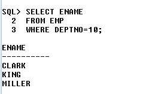
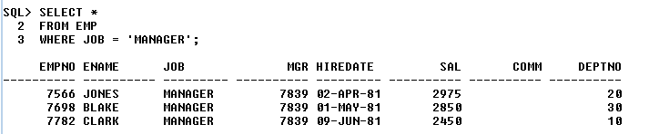

# The SQL*Plus

## 1) how to create a table with out constrain 


```bash
create table EMPLOYEE
(
Sno number(5),
Name varchar(20),
Phone number(10),
branch varchar(5)
);
```
## 2) how to create a table with constrain 


```bash
create table table_name
(
Sno number(5) check(Sno>0) primary key,
Name varchar(20) not null,
Phone number(10) not null unique check(length(Phone)=10),
branch varchar(5) not null
);

```

## 3) how to rename table name 


```bash
RENAME Old_name to new_name;
```
## 4) how to delete table permanently from data base 

```bash
truncate table EMPLOYEE2;
```
### Truncate will empty the table (will not remove the table structure)

## 5) how to drop the table from database


```bash
drop table table_name;
```

## 6) 


# create table Like this 


## THIS QUREY FOR CREATING EMP TABLE

```bash
CREATE TABLE EMP (
    EMPNO NUMBER(4),
    ENAME VARCHAR2(10),
    JOB VARCHAR2(9),
    MGR NUMBER(4),
    HIREDATE DATE,
    SAL NUMBER(7,2),
    COMM NUMBER(7,2),
    DEPTNO NUMBER(2)
);
```

## INSERTING DATA INTO EMP TABLE 

```bash
INSERT INTO EMP VALUES (7369, 'SMITH', 'CLERK', 7902, TO_DATE('17-DEC-80', 'DD-MON-YY'), 800, NULL, 20);
INSERT INTO EMP VALUES (7499, 'ALLEN', 'SALESMAN', 7698, TO_DATE('20-FEB-81', 'DD-MON-YY'), 1600, 300, 30);
INSERT INTO EMP VALUES (7521, 'WARD', 'SALESMAN', 7698, TO_DATE('22-FEB-81', 'DD-MON-YY'), 1250, 500, 30);
INSERT INTO EMP VALUES (7566, 'JONES', 'MANAGER', 7839, TO_DATE('02-APR-81', 'DD-MON-YY'), 2975, NULL, 20);
INSERT INTO EMP VALUES (7654, 'MARTIN', 'SALESMAN', 7698, TO_DATE('28-SEP-81', 'DD-MON-YY'), 1250, 1400, 30);
INSERT INTO EMP VALUES (7698, 'BLAKE', 'MANAGER', 7839, TO_DATE('01-MAY-81', 'DD-MON-YY'), 2850, NULL, 30);
INSERT INTO EMP VALUES (7782, 'CLARK', 'MANAGER', 7839, TO_DATE('09-JUN-81', 'DD-MON-YY'), 2450, NULL, 10);
INSERT INTO EMP VALUES (7788, 'SCOTT', 'ANALYST', 7566, TO_DATE('19-APR-87', 'DD-MON-YY'), 3000, NULL, 20);
INSERT INTO EMP VALUES (7839, 'KING', 'PRESIDENT', NULL, TO_DATE('17-NOV-81', 'DD-MON-YY'), 5000, NULL, 10);
INSERT INTO EMP VALUES (7844, 'TURNER', 'SALESMAN', 7698, TO_DATE('08-SEP-81', 'DD-MON-YY'), 1500, 0, 30);
INSERT INTO EMP VALUES (7876, 'ADAMS', 'CLERK', 7788, TO_DATE('23-MAY-87', 'DD-MON-YY'), 1100, NULL, 20);
INSERT INTO EMP VALUES (7900, 'JAMES', 'CLERK', 7698, TO_DATE('03-DEC-81', 'DD-MON-YY'), 950, NULL, 30);
INSERT INTO EMP VALUES (7902, 'FORD', 'ANALYST', 7566, TO_DATE('03-DEC-81', 'DD-MON-YY'), 3000, NULL, 20);
INSERT INTO EMP VALUES (7934, 'MILLER', 'CLERK', 7782, TO_DATE('23-JAN-82', 'DD-MON-YY'), 1300, NULL, 10);
```

## THIS QUREY FOR CREATING DEPT TABLE

```bash
CREATE TABLE DEPT (
    DEPTNO NUMBER(2),
    DNAME VARCHAR2(14),
    LOC VARCHAR2(13)
);
```
## INSERTING DATA INTO DEPT TABLE 

```bash
INSERT INTO DEPT VALUES (10, 'ACCOUNTING', 'NEW YORK');
INSERT INTO DEPT VALUES (20, 'RESEARCH', 'DALLAS');
INSERT INTO DEPT VALUES (30, 'SALES', 'CHICAGO');
INSERT INTO DEPT VALUES (40, 'OPERATIONS', 'BOSTON');
```
## NOW RUN THIS COMMAND 

```bash
SELECT * FROM EMP;
SELECT * FROM DEPT;
```
## 1) HOW TO DISPLAY NAME FROM EMP TABLE
```bash
SELECT ENAME
FROM EMP;
```


## 2) HOW TO DISPLAY ALL THE COLUMNS FROM EMP TABLE
```bash
SELECT *
FROM EMP;
```


## 3) HOW TO DISPLAY ANNUAL SALARY FOR EMPOYEE
```bash
SELECT SAL*12
FROM EMP;
```


## 4) HOW TO DISPLAY HALF TERM ANNUAL SALARY FOR EMPOYEE
```bash
SELECT SAL*6
FROM EMP;
```


## 5) HOW TO DISPLAY HALF TERM ANNUAL SALARY FOR EMPOYEE
```bash
SELECT SAL*6
FROM EMP;
```


## 6) HOW TO DISPLAY YEAR SALARY WITH 20% HIKE EMPOYEE
```bash
SELECT SAL*12+SAL*12 *20/100
FROM EMP;
```


## 7) HOW TO DISPLAY YEAR SALARY WITH 20% HIKE EMPOYEE
```bash
SELECT SAL*12-SAL*12 *9/100
FROM EMP;
```

<br/>
<br/>

# ALIAS
<h3>
* Alias is an alternative name which is assigned for a column name or an experssion in the result table <br/>
* we can assign alias name with or without using "As" Keywords <br/>
* Alias name must be a Single String Which is Seperate by an Unterscorce or enclosed within double quotes
</h3>

## 1) HOW TO Change output column name 
```bash
SELECT SAL*12 AS ANNUAL_SALARY
FROM EMP;
```
## OR 
```bash
SELECT SAL*12 AS "ANNUAL SALARY"
FROM EMP;
```


# SELECT CLAUS
<h3>
* Select is used to Retive the Data By Selecting Row and Columns
</h3>

## 1) WAQTD names of the employees if they are working in department number 10

```bash


```


## 2) WAQTD detail of the employees if they are not working in department number 10

```bash
SELECT *
FROM EMP
WHERE DEPTNO !=10;
```


## 3) WAQTD det ails of the employees if they are getting salary more than 1000

```bash
SELECT *
FROM EMP
WHERE SAL > 1000;
```


## 4) WAQTD Name Salary and Designation of the employees if they are getting salary less then 5000

```bash
SELECT ENAME,SAL,JOB
FROM EMP
WHERE SAL < 5000;
```


## 5) WAQTD Details of the Employee if they are working as manager

```bash
SELECT *
FROM EMP
WHERE JOB = 'MANAGER';
```


## 6) WAQTD Details of the employee if they hired after 81

```bash
SELECT *
FROM EMP
WHERE HIREDATE > '31-DEC-81';
```


